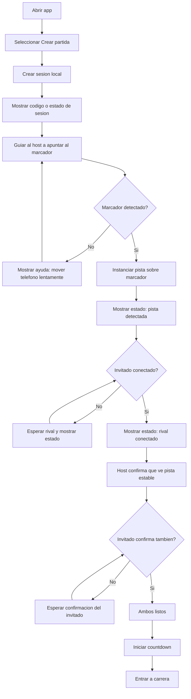
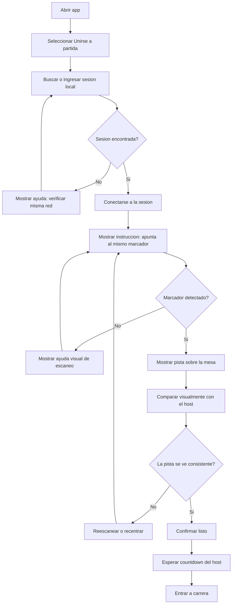
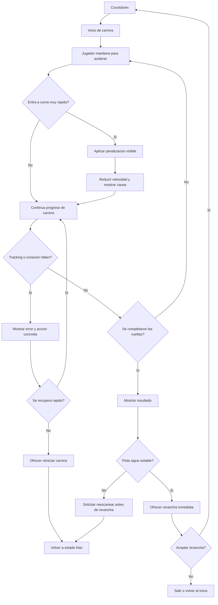

---
stepsCompleted:
  - 1
  - 2
  - 3
  - 4
  - 5
  - 6
  - 7
  - 8
  - 9
  - 10
  - 11
  - 12
  - 13
  - 14
inputDocuments:
  - l:\ARGame\Slot-Car-Racing-AR\_bmad-output\planning-artifacts\gdd-slot-car-racing-ar.md
  - l:\ARGame\Slot-Car-Racing-AR\docs\FORMATO DOCUMENTO PROYECTO MOV. E INTERACCIÓN (1).docx
  - l:\ARGame\Slot-Car-Racing-AR\docs\EXPERIENCIA USUARIO I (1).pdf
workflowType: ux-design
project_name: Slot Car Racing AR
user_name: Jpinzon
date: 2026-04-14
language: es
status: completed
lastStep: 14
---

# UX Design Specification - Slot Car Racing AR

**Author:** Jpinzon
**Date:** 2026-04-14

---

## Executive Summary

### Project Vision

Slot Car Racing AR debe sentirse menos como una app tecnica y mas como un ritual social breve de mesa. Dos jugadores comparten una superficie real, ven una pista miniatura aparecer de manera confiable sobre el mismo marcador fisico y compiten con una sola mecanica de aceleracion basada en timing. El valor UX del proyecto no esta en ofrecer muchas opciones, sino en hacer cuatro cosas muy bien: conectar, alinear, correr y repetir.

La experiencia debe producir tres sensaciones concretas: asombro inicial cuando la pista aparece sobre la mesa, confianza compartida al confirmar que ambos jugadores ven la misma referencia, y tension competitiva inmediata durante carreras cortas que inviten a revancha. Como proyecto academico, su fortaleza no es la complejidad del sistema de carreras, sino la claridad con la que convierte interaccion fisica, AR y juego social en una sesion funcional y medible.

### Target Players

El publico principal son estudiantes y jovenes familiarizados con juegos moviles casuales, con baja tolerancia a configuraciones largas y alta sensibilidad a experiencias sociales presenciales. Dentro de ese grupo hay dos perfiles UX importantes.

El primer perfil es el jugador host. Es quien crea la partida, conecta la red local y normalmente asume el rol de "hacer que todo funcione". Su necesidad principal es sentir control del proceso y recibir estados claros de red, tracking y disponibilidad del otro jugador. Su principal frustracion seria que el sistema parezca ambiguo o que requiera demasiadas pruebas antes de arrancar.

El segundo perfil es el jugador invitado. Llega con menos contexto, no quiere aprender un sistema complejo y necesita entender en pocos segundos que debe hacer: apuntar al mismo marcador, esperar confirmacion, mantener presionado para acelerar y modular su velocidad en curvas. Si esta persona siente que pierde por confusion o por falla tecnica, la experiencia se rompe.

Como audiencia secundaria existe un contexto de observacion academica: companeros y docente pueden ver la sesion mientras ocurre. Esto vuelve importante que la experiencia sea legible tambien para observadores, con estados claros, inicio entendible, colores distinguibles y resultado visible.

### Key Design Challenges

El primer reto UX es construir confianza compartida en la alineacion AR. No basta con que tecnicamente cada telefono detecte el marcador; ambos jugadores deben percibir que efectivamente estan viendo la misma pista. Si aparece la duda de que cada uno ve algo distinto, el corazon de la experiencia colapsa.

El segundo reto es reducir la friccion del setup en condiciones reales de aula o laboratorio. La experiencia depende de una mesa, un marcador fisico, luz suficiente, red local y una postura comoda con el telefono. Demasiados pasos o instrucciones ambiguas convierten el arranque en una barrera en lugar de una introduccion.

El tercer reto es hacer que una mecanica de un solo boton se perciba como habilidad y no como azar. El jugador debe entender muy rapido que la victoria depende del timing de aceleracion en curvas, no de apretar sin criterio ni de una regla oculta del sistema.

El cuarto reto es la fatiga fisica y cognitiva. Sostener el telefono mientras se apunta a la mesa y se sigue una carrera puede cansar o saturar. Por eso la experiencia debe ser breve, con HUD minimo, mensajes concretos y una organizacion visual que no compita con la pista AR.

El quinto reto es disenar para fallo y recuperacion. Tracking perdido, red inestable o desalineacion no pueden convertirse en callejones sin salida. La UX debe comunicar claramente que esta pasando y como volver a la carrera sin reiniciar toda la experiencia si no es necesario.

### Design Opportunities

La primera gran oportunidad es convertir el setup en parte de la magia. Colocar el marcador, apuntar ambos telefonos y ver aparecer la pista puede funcionar como un pequeno ritual de entrada a la experiencia, en lugar de sentirse como una calibracion tecnica molesta.

La segunda oportunidad es usar feedback de estado para construir confianza. Indicadores de tracking estable, confirmacion de que ambos jugadores estan listos y mensajes claros de conexion pueden transformar una experiencia fragil en una experiencia percibida como solida y controlada.

La tercera oportunidad es disenar una carrera muy legible tanto para jugadores como para observadores. Colores de carro consistentes, vueltas visibles, countdown claro y resultado inmediato pueden hacer que el juego se entienda rapido incluso desde fuera.

La cuarta oportunidad es apoyarse en la revancha como motor UX principal. Si la pista sigue estable, permitir reinicio rapido sin rehacer todo el setup puede multiplicar la percepcion de fluidez y hacer que la experiencia parezca un producto terminado en lugar de una demo puntual.

La quinta oportunidad es alinear directamente los criterios de UX del curso con decisiones de diseño medibles. Facilidad de aprendizaje, eficiencia de setup, claridad de informacion, satisfaccion y deseabilidad pueden convertirse en objetivos concretos de la experiencia y no en discurso abstracto.

## Core Player Experience

### Defining Experience

Slot Car Racing AR es una carrera AR local de preparacion breve y lectura inmediata. Un jugador crea la sesion, el otro se une, ambos apuntan al mismo marcador fisico, verifican que ven una pista suficientemente consistente para competir y comienzan una carrera corta donde la habilidad real es acelerar y soltar con buen timing en curvas.

El valor del MVP no esta en la profundidad del sistema de carreras, sino en la satisfaccion inmediata de confirmar una pista AR compartida y convertir un solo boton en una competencia tensa, comprensible y justa entre dos personas en el mismo espacio. La secuencia que define la experiencia es: unirse, confirmar, correr y pedir revancha.

La experiencia debe pasar del asombro inicial al desafio competitivo en menos de dos minutos, siempre que ambos jugadores ya tengan permisos concedidos y esten en la misma red local.

### Platform Strategy

La experiencia del MVP se disena exclusivamente para Android, 2 jugadores, una sola sesion local sobre hotspot o Wi-Fi comun, un marcador fisico compartido y una pista predefinida. El foco UX no es adaptarse a multiples plataformas, sino asegurar robustez visual, estados claros, lectura inmediata y reinicio rapido en telefonos Android compatibles con ARCore, tomando como referencia el Samsung S24 FE.

Toda la interaccion se piensa para pantalla tactil, camara activa, dispositivo sostenido en mano y uso alrededor de una mesa real. Esto obliga a que el flujo sea corto, el HUD sea minimo y el boton principal sea grande, evidente y usable sin instruccion extensa.

### Effortless Interactions

Las interacciones clave no deben ser completamente invisibles, pero si de baja friccion y sin ambiguedad. La interfaz debe responder con claridad, durante la primera sesion, a estas preguntas:

- Como me uno a la partida.
- Donde tengo que apuntar.
- Si la pista ya quedo fija.
- Si mi rival ve la misma referencia de juego.
- Que hace mi unico boton.
- Si ya podemos empezar.
- Como repetimos sin rehacer toda la configuracion.

Las interacciones esenciales del MVP son:

- crear o unirse a una sesion local
- apuntar al marcador compartido
- confirmar que la pista esta lista para ambos
- entender la regla de aceleracion con una sola instruccion
- iniciar la carrera sin dudas
- lanzar revancha rapidamente
- recuperarse de tracking perdido o desconexion con una accion clara

La instruccion central de primera partida debe poder reducirse a una sola frase: Manten para acelerar. Suelta en curvas.

### Critical Success Moments

El primer momento critico ocurre cuando ambos jugadores ven aparecer la pista y entienden que esta suficientemente fija sobre la mesa para jugar. Ese no es solo un momento tecnico; es la prueba de confianza compartida.

El segundo momento critico es la confirmacion de listos. Ambos jugadores deben ver de forma simetrica y clara que la carrera puede empezar.

El tercer momento critico es la primera curva relevante. Ese punto debe ensenar inmediatamente que acelerar sin timing genera una penalizacion comprensible, no arbitraria.

El cuarto momento critico es la llegada a meta. El resultado debe leerse en un vistazo y convertir el cierre de carrera en energia de revancha.

El quinto momento critico es la recuperacion ante falla. Si se pierde tracking o se cae la sesion, el sistema debe explicar que paso y ofrecer una salida concreta: reescanear, realinear o reiniciar.

### Experience Principles

- Claridad antes que espectacularidad.
- El sistema siempre debe mostrar su estado.
- La confianza compartida importa mas que la precision perfecta.
- Un input debe producir una consecuencia clara y aprendible.
- El setup debe sentirse como confirmacion compartida, no como tarea.
- La revancha debe ser mas rapida que la configuracion inicial.
- Cuando el sistema falla, debe explicarlo y ofrecer una accion concreta.

## Desired Emotional Response

### Primary Emotional Goals

La emocion principal que debe provocar Slot Car Racing AR es asombro compartido convertido rapidamente en competencia confiable. El jugador debe sentir, en muy poco tiempo, que una mesa comun se transformo en un espacio de juego especial y que esa transformacion no es solo visualmente llamativa, sino tambien jugable y justa.

Las metas emocionales principales del MVP son:

- asombro inicial al ver aparecer la pista sobre la mesa
- confianza al confirmar que ambos jugadores ven una referencia suficientemente consistente para competir
- control al comprender que un solo boton basta para jugar
- tension competitiva durante la carrera
- satisfaccion inmediata al terminar y querer revancha

La experiencia no debe apoyarse en complejidad o sorpresa continua. Debe apoyarse en una combinacion muy concreta: magia inicial, claridad durante el juego y energia social al final de cada carrera.

### Emotional Journey Mapping

El recorrido emocional del jugador debe evolucionar por etapas claras.

**Descubrimiento e inicio**
Al abrir la experiencia, el jugador debe sentir curiosidad y expectativa. La interfaz debe hacerle pensar: esto parece facil de empezar y vale la pena probarlo.

**Escaneo y confirmacion**
Cuando el marcador se detecta y la pista aparece, el jugador debe pasar de curiosidad a asombro. Cuando el sistema confirma que la pista esta lista para ambos, ese asombro debe transformarse en confianza compartida.

**Cuenta regresiva e inicio de carrera**
En la transicion al gameplay, la emocion dominante debe ser anticipacion. El jugador debe sentir que todo esta listo y que el reto comienza ya, sin duda ni ambiguedad.

**Primera curva y aprendizaje**
Aqui la emocion debe pasar a concentracion y descubrimiento. Si el jugador falla, debe sentir que aprendio algo util, no que el juego fue arbitrario.

**Meta y resultado**
Al terminar, el jugador debe sentir que el resultado fue claro, justo y facil de aceptar. El ganador debe sentir satisfaccion; el perdedor debe sentir deseo de revancha, no frustracion tecnica.

**Retorno y repeticion**
Al volver a jugar, la experiencia debe sentirse mas fluida y mas segura. La emocion esperada es impulso competitivo: otra vez, ahora lo hago mejor.

### Micro-Emotions

Hay micro-emociones criticas que este proyecto debe provocar o evitar deliberadamente.

**Micro-emociones a buscar**
- confianza: sentir que el sistema esta listo y que el estado de la partida es claro
- sorpresa: ver la pista aparecer de forma convincente
- seguridad: entender que se espera del jugador en cada momento
- tension: sentir que cada curva importa
- justicia: percibir que el resultado depende del timing y no de fallos ocultos
- complicidad social: sentir que ambos estan compartiendo la misma experiencia
- impulso de revancha: querer repetir sin pensarlo demasiado

**Micro-emociones a evitar**
- confusion: no saber que hacer o que estado tiene la sesion
- escepticismo: dudar de si ambos realmente ven la misma pista
- ansiedad tecnica: sentir que cualquier error puede romper la experiencia
- frustracion injusta: perder sin entender por que
- fatiga: sentir que sostener el telefono o rehacer el setup pesa mas que jugar
- anticlimax: terminar una carrera y no sentir ganas de repetir

### Design Implications

Si queremos generar asombro, la aparicion de la pista debe ser inmediata, legible y visualmente estable. La pista no necesita ser compleja; necesita parecer convincente sobre la mesa.

Si queremos generar confianza, la interfaz debe mostrar estados claros y compartidos: buscando marcador, pista lista, rival conectado, listos para iniciar. La confianza no puede quedar implicita.

Si queremos generar control, el sistema debe enseñar una sola regla de forma brutalmente simple: mantener para acelerar, soltar en curvas. La primera penalizacion debe explicar la mecanica, no castigarla de forma opaca.

Si queremos generar tension competitiva, la carrera debe ser corta, el progreso debe ser visible y el resultado debe sentirse inmediato. La lectura del HUD debe ser rapida y no competir con la pista AR.

Si queremos generar revancha, el final de carrera debe resolver rapido y ofrecer reinicio sin friccion. La emocion correcta despues de perder no es molestia, sino pensamiento de mejora: ahora entiendo, otra vez.

**Emotion-Design Connections**
- Asombro → aparicion clara de la pista y confirmacion visual fuerte del anclaje
- Confianza → estados visibles, mensajes concretos y confirmacion compartida
- Control → una sola instruccion, una sola accion y una consecuencia comprensible
- Tension → curvas legibles, ritmo corto y progreso visible
- Revancha → cierre rapido, resultado claro y reinicio simple

### Emotional Design Principles

- El sistema debe transformar sorpresa en confianza, no dejar la sorpresa sola.
- La primera sesion debe sentirse guiada, no tecnica.
- Cada estado importante debe reducir duda y aumentar seguridad.
- La primera curva debe ensenar, no humillar.
- El resultado final debe sentirse justo incluso cuando se pierde.
- La experiencia debe invitar a repetir antes de enfriarse emocionalmente.
- Cuando algo falle, la interfaz debe proteger la confianza del jugador explicando que paso y que hacer ahora.

## UX Pattern Analysis & Inspiration

### Inspiring Products Analysis

**Mario Kart Tour**
Mario Kart Tour resuelve muy bien la lectura inmediata de una carrera movil. Su mayor valor UX no esta en la simulacion, sino en como deja claro que esta ocurriendo en pantalla: posicion, progreso, curva, feedback y resultado. La interfaz trabaja para que el jugador sienta velocidad y competencia sin perder orientacion.

Patrones utiles para este proyecto:
- HUD muy legible durante carreras cortas
- feedback visual fuerte para eventos importantes
- resultados faciles de entender al terminar
- sensacion de "otra carrera mas" sin mucha friccion

Lo que aporta a Slot Car Racing AR es una referencia clara de como disenar una carrera breve, con informacion minima pero suficiente.

**Pokemon GO**
Pokemon GO no es una referencia de carrera, pero si es una referencia valiosa para interacciones fisicas mediadas por camara. Lo mas util aqui es como traduce acciones tecnicas en pasos comprensibles para usuarios no tecnicos: permisos, camara, escaneo, confirmacion visual y uso del espacio fisico.

Patrones utiles para este proyecto:
- uso de lenguaje simple para procesos tecnicamente complejos
- guia progresiva durante flujos basados en camara
- confirmaciones visibles para generar confianza
- interaccion entre espacio fisico y sistema digital sin depender de jerga tecnica

Lo que aporta a Slot Car Racing AR es una referencia para convertir tracking, anclaje y confirmacion compartida en un flujo guiado y entendible.

**Brawl Stars**
Brawl Stars destaca por su velocidad de entrada, claridad de rol, loop corto y fuerte impulso de repeticion. Es muy eficiente mostrando que hacer, cuando empieza la accion y como volver a entrar a otra partida con poca friccion.

Patrones utiles para este proyecto:
- navegacion minima antes de entrar al juego
- estados muy claros de espera, inicio y resultado
- sesiones cortas con ritmo alto
- fuerte energia de revancha y repeticion

Lo que aporta a Slot Car Racing AR es una referencia para disenar un ciclo corto: entrar, correr, terminar, repetir.

### Transferable UX Patterns

**Patrones de navegacion**
- Pantalla inicial con pocas opciones y caminos muy claros.
  Esto puede aplicarse a `Crear partida` y `Unirse a partida`.
- Flujo progresivo por estados visibles.
  Esto sirve para guiar al jugador desde red local hasta pista lista sin menus complejos.

**Patrones de interaccion**
- Una accion principal dominante por momento.
  En este proyecto: crear/unirse, apuntar al marcador, confirmar pista, acelerar, revancha.
- Feedback inmediato para eventos clave.
  Ejemplo: marcador detectado, pista lista, rival conectado, cuenta regresiva, penalizacion, meta.
- Repeticion sin recarga cognitiva.
  Si la pista sigue estable, la revancha debe evitar rehacer pasos.

**Patrones visuales**
- HUD reducido al minimo necesario durante la accion.
- Colores consistentes para identidad y estado.
- Jerarquia visual alta para estados criticos: listo, corriendo, error, revancha.
- Confirmaciones visuales fuertes cuando el sistema quiere generar confianza.

### Anti-Patterns to Avoid

- Sobrecargar la pantalla AR con demasiados elementos UI.
  Esto rompe la legibilidad de la pista y cansa visualmente.
- Explicar el tracking con lenguaje tecnico.
  El jugador no necesita entender ARCore ni anclajes; necesita saber que hacer.
- Obligar a rehacer toda la configuracion entre carreras.
  Eso mata la energia de revancha.
- Ocultar estados importantes del sistema.
  Si el jugador no sabe si el rival ya esta listo o si la pista esta estable, aparece desconfianza.
- Castigar al jugador en la primera curva sin haberle ensenado claramente la regla.
  Eso convierte dificultad en frustracion injusta.
- Disenar la experiencia como si fuera individual.
  Este proyecto depende de percepcion compartida; la interfaz debe reconocer que hay dos personas verificando la misma realidad.

### Design Inspiration Strategy

**What to Adopt**
- De Mario Kart Tour:
  claridad de carrera, HUD reducido y resultado facil de leer.
- De Pokemon GO:
  guia por pasos para interacciones con camara y lenguaje no tecnico.
- De Brawl Stars:
  loop corto, estado de inicio claro y empuje fuerte hacia revancha.

**What to Adapt**
- El onboarding de AR debe simplificarse mas que en Pokemon GO.
  Aqui el objetivo no es explorar, sino confirmar rapido y correr.
- La lectura de carrera debe ser mas simple que en Mario Kart Tour.
  Este juego no necesita complejidad de items ni posicionamiento multiple.
- La energia de repeticion de Brawl Stars debe adaptarse a una experiencia presencial de mesa.
  La revancha aqui depende de mantener la pista estable y la atencion compartida.

**What to Avoid**
- Menus profundos antes de jugar.
- HUD cargado o poco contrastado sobre la camara.
- Estados ambiguos de red o tracking.
- Penalizaciones poco explicadas.
- Cualquier flujo que haga sentir que la parte tecnica pesa mas que la parte ludica.

La estrategia final de inspiracion para Slot Car Racing AR debe ser esta: tomar la claridad competitiva de un juego de carrera movil, la guia comprensible de una app basada en camara y la velocidad de repeticion de un juego multijugador casual, adaptandolo todo a una experiencia presencial, breve y compartida sobre una mesa real.

## Design System Foundation

### 1.1 Design System Choice

Para Slot Car Racing AR se elige un sistema de diseno custom y liviano, construido directamente en Unity para HUD, overlays, estados de sistema y pantallas de flujo. No se recomienda basarse en sistemas visuales generalistas como Material Design ni trasladar patrones de librerias web, porque el proyecto no necesita una app compleja de navegacion, sino una interfaz de juego AR muy controlada, con pocos elementos y alta legibilidad sobre camara.

El enfoque correcto para este MVP es un mini design system propio, centrado en:

- componentes UI minimos y reutilizables
- estados visibles de tracking, conexion y readiness
- HUD de carrera de muy baja complejidad
- consistencia de color y jerarquia visual
- claridad sobre espectacularidad

### Rationale for Selection

Se elige esta aproximacion por cuatro razones principales.

Primero, el proyecto tiene una ventana de desarrollo corta y una interaccion muy especifica. Un sistema amplio o altamente configurable seria costo extra sin beneficio proporcional. Lo que se necesita no es amplitud de componentes, sino precision en unos pocos elementos criticos.

Segundo, la interfaz vive sobre camara y AR. Eso exige decisiones visuales hechas para contraste, lectura inmediata y baja interferencia con la pista. Un sistema visual pensado para apps tradicionales no resolveria bien ese contexto.

Tercero, Unity ya sera el entorno de implementacion. Es mas eficiente definir un conjunto pequeno de prefabs, estilos y reglas visuales internas que intentar adaptar patrones externos que no responden a una experiencia de juego presencial y compartida.

Cuarto, el juego depende de estados de confianza mas que de navegacion profunda. La UI debe comunicar claramente cuando el sistema esta buscando marcador, cuando la pista esta lista, cuando el rival esta conectado y cuando la carrera puede empezar. Esa necesidad se resuelve mejor con un sistema muy especifico del proyecto.

### Implementation Approach

La implementacion del sistema de diseno debe apoyarse en un conjunto reducido de componentes reutilizables dentro de Unity.

**Componentes base del sistema**
- Boton primario de accion
  Usado para `Crear partida`, `Unirse`, `Confirmar pista`, `Listo`, `Revancha`.
- Panel de estado
  Usado para tracking, conexion, espera del rival, error y recuperacion.
- Overlay de countdown
  Usado para inicio de carrera.
- HUD de carrera
  Usado para vuelta, posicion y estado puntual.
- Tarjeta de resultado
  Usada para ganador, diferencia y acciones finales.
- Toast o mensaje breve contextual
  Usado para avisos como "marcador detectado", "reapunta al marcador" o "rival conectado".

**Arquitectura visual**
- una sola tipografia clara y altamente legible
- jerarquia visual fuerte en acciones primarias
- minimo de elementos simultaneos sobre camara
- uso de iconografia solo cuando realmente ayude
- feedback visual de estado antes que decoracion

**Estados del sistema que deben estandarizarse**
- buscando marcador
- marcador encontrado
- pista lista
- rival conectado
- esperando rival
- listos para iniciar
- corriendo
- tracking perdido
- conexion perdida
- revancha disponible

### Customization Strategy

La personalizacion del sistema no debe buscar complejidad estetica, sino identidad coherente con el concepto de pista miniatura compartida.

**Direccion visual base**
- interfaz limpia y compacta
- inspiracion en senalizacion de carrera y paneles de slot car
- contraste alto sobre video de camara
- colores funcionales por estado y por jugador

**Sistema de color sugerido**
- rojo: jugador 1 y alertas criticas
- verde: jugador 2 y confirmaciones positivas
- amarillo o ambar: advertencias, espera, preparacion
- blanco o gris claro: texto principal y etiquetas
- negro o gris oscuro semitransparente: fondos de panel para mantener lectura sobre camara

**Reglas de personalizacion**
- el color nunca debe reemplazar texto de estado; siempre deben coexistir
- el HUD no debe usar ornamentos que tapen la pista
- cada pantalla debe tener una sola accion dominante
- los mensajes de error deben mantener el mismo tono y estructura
- los componentes deben verse consistentes en menu, escaneo, carrera y resultado

**Nivel de detalle recomendado**
- botones grandes y tactiles
- bordes simples
- overlays semitransparentes
- animaciones cortas y funcionales
- cero efectos visuales decorativos que compitan con la pista AR

## 2. Core Player Experience

### 2.1 Defining Experience

La experiencia definitoria de Slot Car Racing AR es esta: dos jugadores convierten una mesa comun en una pista de carreras compartida, verifican que ambos estan viendo la misma referencia de juego y compiten usando una sola habilidad central: acelerar con buen timing y soltar en curvas para no perder control.

Si esta interaccion se siente clara, justa y rapida de aprender, todo lo demas acompana. Si falla, el proyecto pierde valor aunque el resto del sistema funcione. El nucleo no es "usar AR" ni "correr en movil"; el nucleo es sentir que la pista compartida es real, que la carrera es entendible y que el resultado depende de una decision simple pero significativa.

La forma en que un jugador probablemente describa la experiencia a otra persona deberia ser algo como: Apuntamos ambos al mismo marcador, aparecio la pista sobre la mesa y competimos con un solo boton viendo quien soltaba mejor en las curvas.

Ese es el centro de la UX. No la cantidad de pantallas, no la complejidad del HUD y no la simulacion de manejo.

### 2.2 Player Mental Model

El jugador llega con varias ideas previas que influyen en como entiende el sistema.

Primero, espera que la camara "reconozca algo" y que el juego le muestre claramente cuando ese reconocimiento ya es suficiente para jugar. No piensa en tracking, anclajes o calibracion; piensa en algo mas simple: ya quedo bien o todavia no.

Segundo, entiende una carrera de slot car como una experiencia donde no necesita aprender muchos controles. Su expectativa natural es que el desafio no este en mover libremente el carro, sino en controlar velocidad y ritmo. Esto favorece mucho la propuesta de un solo boton.

Tercero, al tratarse de una experiencia compartida, el jugador necesita una validacion social del sistema. No le basta ver la pista en su propia pantalla; quiere saber que la otra persona tambien la ve de forma consistente y que ambos estan compitiendo en condiciones suficientemente justas.

Cuarto, en su primera sesion probablemente no piense en estrategia compleja. Pensara en preguntas simples:
Como entro.
Donde apunto.
Si ya quedo bien.
Cuando empieza.
Que hace el boton.
Por que falle en la curva.
Como pido revancha.

Si la UX responde bien a esas preguntas, el modelo mental se alinea rapido. Si no, aparece duda tecnica y la magia se pierde.

### 2.3 Success Criteria

La interaccion central se puede considerar exitosa si cumple estas condiciones:

- Ambos jugadores logran entrar a la misma sesion local sin confusion.
- Ambos entienden cuando la pista ya esta lista para jugar.
- El primer uso del boton de aceleracion se entiende sin tutorial largo.
- La primera penalizacion por curva ensena la regla en vez de sentirse arbitraria.
- El progreso de la carrera se puede leer sin esfuerzo.
- El resultado final se entiende en un vistazo.
- La revancha puede ocurrir sin rehacer innecesariamente todo el flujo.

Indicadores claros de exito:

- El jugador dice "ya entendi" antes de terminar la primera carrera.
- El jugador interpreta correctamente que debe soltar en curva.
- El jugador distingue con claridad estados como listo, corriendo, error y revancha.
- El jugador quiere repetir aunque haya perdido.

### 2.4 Novel UX Patterns

La experiencia combina patrones familiares con una capa novedosa.

Patrones ya conocidos:
- Crear o unirse a una sesion.
- Confirmar estado de listo.
- Cuenta regresiva antes de competir.
- Ver resultado y repetir.

Patrones parcialmente novedosos:
- Apuntar ambos al mismo marcador fisico para compartir la misma referencia espacial.
- Confirmar visualmente que la pista esta suficientemente consistente para ambos.
- Aprender una sola mecanica de timing en un entorno AR sobre mesa.

Esto significa que el proyecto no necesita educar al usuario en todo el sistema, pero si necesita ensenar una novedad importante: la competencia depende de una realidad compartida verificada, no solo de lo que cada uno ve por separado.

La mejor estrategia UX no es inventar una metafora nueva, sino combinar patrones familiares de partida multijugador con confirmaciones visuales muy claras de estado AR. La ensenanza debe apoyarse en frases muy simples y estados visibles, no en explicaciones largas.

### 2.5 Experience Mechanics

**1. Initiation**

- Un jugador crea la partida.
- El otro se une desde la misma red local.
- Ambos reciben una instruccion simple para apuntar al mismo marcador sobre la mesa.
- El sistema comunica visualmente estados como buscando marcador, pista detectada y rival conectado.

**2. Interaction**

- Cada jugador sostiene su telefono apuntando a la mesa.
- Cuando el sistema detecta el marcador, muestra la pista sobre la superficie.
- Ambos deben confirmar que la pista esta lista.
- Empieza la cuenta regresiva.
- Durante la carrera, la interaccion principal es mantener presionado para acelerar y soltar al llegar a curvas.

**3. Feedback**

- El sistema muestra si el marcador fue detectado.
- El sistema indica si el rival ya esta conectado y listo.
- La cuenta regresiva marca el inicio compartido.
- La HUD informa vuelta, posicion y eventos importantes.
- Si el jugador falla una curva, la penalizacion debe ser visible y comprensible.
- Si el tracking o la conexion fallan, el sistema debe explicar el problema y sugerir una accion concreta.

**4. Completion**

- La carrera termina cuando un jugador completa primero el numero de vueltas definido.
- El resultado se presenta de forma rapida, clara y visualmente legible.
- La interfaz ofrece revancha inmediata.
- Si la pista sigue estable, la revancha reutiliza el estado actual para minimizar friccion.

## Visual Design Foundation

### Color System

La base visual de Slot Car Racing AR debe mezclar energia arcade con claridad tecnica sobre camara. El objetivo no es llenar la pantalla de color, sino usar color de forma estrategica para separar tres capas: identidad de jugador, estado del sistema y acciones principales.

**Estrategia de color**
- Fondo de overlays: oscuro semitransparente para asegurar lectura sobre video de camara
- Color de accion principal: ambar energetico para CTA y countdown
- Color de confirmacion tecnica: cian brillante para estados de pista lista o sistema estable
- Colores de jugador: rojo para jugador 1, verde para jugador 2
- Color de advertencia: ambar
- Color de error critico: rojo de sistema, solo para fallos reales

**Paleta sugerida**
- Fondo base overlay: `#10141C`
- Fondo secundario: `#1A2230`
- Texto principal: `#F5F7FA`
- Texto secundario: `#C7D0DB`
- CTA / acento principal: `#FFC247`
- Confirmacion / estado listo: `#3DD9FF`
- Jugador 1: `#FF5A5F`
- Jugador 2: `#39D98A`
- Advertencia: `#FFB020`
- Error: `#FF4D4F`

**Reglas semanticas**
- El color nunca reemplaza el significado textual.
- Los colores de jugador no deben usarse para errores del sistema salvo que se distingan claramente por contexto y texto.
- El color de confirmacion tecnica debe comunicar estabilidad, no victoria.
- La pantalla de carrera debe mantener como prioridad la pista AR; la UI solo usa color para reforzar lectura rapida.

### Typography System

La tipografia debe sentirse rapida, clara y competitiva, pero sin perder legibilidad en movil. Como el proyecto usa poco texto, conviene un sistema de dos niveles: una tipografia con caracter para titulos y numeros, y una tipografia muy legible para estados e instrucciones breves.

**Sistema tipografico sugerido**
- Tipografia de display: `Rajdhani` o `Oxanium`
  Para countdown, titulos, resultado, etiquetas grandes de carrera.
- Tipografia de interfaz: `Barlow` o `Noto Sans`
  Para estados, mensajes de ayuda, botones e instrucciones cortas.

**Jerarquia sugerida**
- H1 / pantalla de resultado: 32-36 px
- H2 / titulos de flujo: 24-28 px
- Numeros HUD / countdown: 24-32 px
- Boton principal: 18-20 px
- Texto base de estado: 16 px
- Texto auxiliar: 14 px
- Microtexto: evitarlo salvo casos excepcionales

**Principios tipograficos**
- Muy poco texto por pantalla
- Frases cortas y accionables
- Prioridad alta para numeros, estados y acciones
- Nada de parrafos largos sobre camara
- Mensajes de error siempre en una linea principal y una accion sugerida

### Spacing & Layout Foundation

La interfaz debe sentirse compacta y funcional, como un panel de carrera ligero superpuesto sobre el mundo real. El layout debe respetar la pista y no competir con ella.

**Base de espaciado**
- Sistema base: multiplos de 8
- Microajustes: 4
- Espaciado entre bloques principales: 16 o 24
- Margenes seguros desde borde: minimo 16
- Boton principal tactil: minimo 56x56 dp, ideal mas grande en carrera

**Principios de layout**
- Una sola accion dominante por pantalla
- Estados tecnicos agrupados y consistentes
- HUD anclado a zonas seguras, no sobre el centro visual de la pista
- Paneles y toasts semitransparentes, nunca opacos completos salvo pantalla de resultado
- Resultado y revancha deben ocupar el foco total al terminar la carrera

**Distribucion sugerida**
- Parte superior: estado de tracking, conexion y readiness
- Zona media: libre para la pista AR
- Parte inferior: boton principal de accion
- Esquinas: HUD secundario como vuelta o posicion, siempre con contraste claro

### Accessibility Considerations

Aunque sea un MVP academico, la base visual debe evitar errores basicos de legibilidad y uso.

**Reglas minimas**
- Contraste alto para texto sobre overlays
- Nunca comunicar un estado solo con color
- Botones grandes y faciles de pulsar con una mano
- Tamano minimo funcional de texto: 14 px
- Estados criticos con redundancia visual y textual
- Evitar overlays excesivos que oculten la pista
- Penalizacion, pista lista, error y revancha deben poder reconocerse en menos de un segundo

**Criterios de accesibilidad practica**
- Si el jugador mira rapido la pantalla, debe distinguir que estado tiene la sesion
- Si el jugador falla una curva, debe entender por que sin leer un bloque largo
- Si el tracking falla, la accion correctiva debe verse de inmediato
- El HUD debe seguir siendo legible en condiciones normales de aula o interior

## Design Direction Decision

### Design Directions Explored

Se exploraron seis direcciones visuales para Slot Car Racing AR, todas construidas sobre la misma base UX: dos jugadores, una sola pista AR compartida, un solo boton de aceleracion, estados visibles de sistema y revancha rapida.

Las variantes cubrieron seis enfoques distintos:

- Pit Board Sprint:
  un lenguaje mas tecnico y compacto, cercano a un panel de carrera.
- Toy Track Signal:
  una direccion mas amigable, miniatura y social, con fuerte claridad visual.
- Neon Telemetry:
  una lectura mas futurista y energetica, con enfasis en countdown y telemetria.
- Garage Pop:
  una version mas calida y arcade, con tono mas jugueton.
- Broadcast Duel:
  una direccion pensada para legibilidad de observadores y resultados.
- Precision Grid:
  la opcion mas sobria, dura y orientada a MVP implementable.

La evaluacion comparativa se hizo considerando claridad, lectura sobre camara, confianza compartida, facilidad de onboarding y energia de revancha.

### Chosen Direction

Se selecciona como direccion base `Toy Track Signal`.

Esta direccion destaca por equilibrar muy bien tres necesidades del proyecto:

- hace que la experiencia AR se sienta accesible y no excesivamente tecnica
- refuerza la idea de pista miniatura sobre mesa real
- mantiene suficiente claridad de estado para que el flujo multijugador siga siendo confiable

Toy Track Signal transmite mejor la idea de juego compartido y de objeto ludico aumentado. Visualmente acompana la fantasia del proyecto sin convertir la interfaz en un panel demasiado frio o demasiado serio.

### Design Rationale

La eleccion de esta direccion responde a la naturaleza del proyecto academico y a su promesa de experiencia.

Primero, el juego necesita generar asombro y confianza en la primera sesion. Una direccion demasiado tecnica puede comunicar robustez, pero tambien puede alejar emocionalmente al jugador. Toy Track Signal conserva claridad, pero con una capa de cercania visual que hace que la experiencia se sienta mas invitante.

Segundo, la pista AR debe sentirse como un objeto compartido y casi tangible sobre la mesa. Esta direccion fortalece la idea de miniatura, maqueta y juguete competitivo, que encaja mejor con una experiencia slot car que con una interfaz tipo dashboard puro.

Tercero, el proyecto necesita que el onboarding sea rapido y amigable. Toy Track Signal permite que estados como pista detectada, rival conectado, listo para correr y revancha se comuniquen con lenguaje visual claro sin caer en rigidez excesiva.

Cuarto, esta direccion sostiene bien el tono arcade energetico que definimos antes, pero sin sacrificar contraste ni legibilidad. Eso la vuelve mas coherente con el objetivo de una experiencia breve, social y repetible.

### Implementation Approach

La implementacion debe tomar Toy Track Signal como base de lenguaje visual, no como permiso para sobrecargar la interfaz. La direccion debe materializarse de esta forma:

- overlays compactos y amigables
- etiquetas visuales claras para estados de red y tracking
- uso de color para reforzar identidad de jugador y confirmacion de sistema
- boton principal grande y dominante
- tarjetas breves para confirmacion, error y resultado
- HUD reducido y facil de leer sobre la pista

La pista AR y el mundo compartido deben seguir siendo el foco visual. La UI solo debe apoyar comprension, confianza y ritmo.

Como regla de implementacion:
- mantener el tono miniatura y social de la direccion elegida
- preservar contraste alto sobre camara
- evitar que lo jugueton se convierta en ruido visual
- mantener mensajes muy breves
- priorizar revancha rapida y estados visibles antes que decoracion

## Player Journey Flows

### Journey 1 - Host crea sesion y valida pista compartida

Este journey cubre el flujo del jugador que inicia la experiencia. Su objetivo no es solo crear una sala, sino establecer condiciones de confianza para que ambos jugadores puedan correr sobre la misma pista sin ambiguedad.

Puntos clave del flujo:
- entrada directa desde pantalla inicial
- creacion de sesion local
- guia breve para red y marcador
- escaneo del marcador
- espera del segundo jugador
- confirmacion de pista lista para ambos
- transicion clara a cuenta regresiva

### Journey 2 - Invitado se une y verifica la misma referencia

Este journey cubre al segundo jugador, que llega con menos contexto y necesita un flujo mas guiado. El objetivo UX principal aqui es reducir dudas: como entrar, donde apuntar y como saber que esta viendo una pista suficientemente consistente para competir.

Puntos clave del flujo:
- entrar rapidamente a sesion existente
- entender que debe mirar la misma mesa
- verificar pista compartida, no solo pista local
- confirmar estado listo con minima friccion

### Journey 3 - Carrera, aprendizaje, resultado y revancha

Este journey cubre la interaccion que define el valor del juego: mantener para acelerar, soltar en curvas, entender la penalizacion y cerrar en revancha rapida. Aqui el exito depende de que el jugador lea el estado, aprenda la regla en la primera carrera y no pierda confianza si ocurre un fallo tecnico.

Puntos clave del flujo:
- countdown claro
- una sola accion central
- penalizacion comprensible
- resultado legible
- revancha sin rehacer setup completo si la pista sigue estable
- recuperacion guiada ante perdida de tracking o sesion

### Journey Patterns

Patrones comunes detectados entre los tres journeys:

- El sistema siempre debe mostrar un estado visible y accionable.
- Cada flujo importante debe responder que pasa ahora y que debe hacer el jugador.
- Las confirmaciones compartidas valen mas que las confirmaciones individuales.
- La recuperacion de errores debe ocurrir dentro del flujo cuando sea posible.
- La revancha debe reutilizar el estado actual si la pista sigue siendo valida.

Patrones de navegacion:
- Inicio binario: crear o unirse.
- Progresion paso a paso con una sola accion dominante.
- Transiciones cortas entre setup, carrera y resultado.

Patrones de feedback:
- Confirmaciones claras de marcador, red, rival y estado listo.
- Countdown como puente emocional y funcional entre setup y carrera.
- Penalizacion visible con causa legible.
- Resultado breve, claro y orientado a repeticion.

### Flow Optimization Principles

- Reducir pasos al valor: correr rapido importa mas que mostrar demasiadas pantallas.
- Minimizar ambiguedad: el jugador nunca debe adivinar si la pista esta lista o si el rival ya confirmo.
- Ensenar con el flujo: la primera curva y la primera penalizacion deben actuar como tutorial practico.
- Evitar reinicios innecesarios: si algo puede recuperarse sin rehacer el setup completo, debe hacerse asi.
- Disenar para dos personas: cada journey debe considerar percepcion compartida, no solo interaccion individual.
- Mantener energia social: el final de carrera debe empujar naturalmente a revancha o nuevo intento.

## Component Strategy

### Design System Components

Dado que el proyecto usa un design system custom y liviano dentro de Unity, los componentes fundacionales ya definidos cubren una parte importante del flujo general. Estos son los componentes base disponibles:

- Boton primario de accion
- Panel de estado
- Overlay de countdown
- HUD base de carrera
- Tarjeta de resultado
- Toast o mensaje breve contextual

Estos componentes resuelven la base visual y de interaccion del sistema, pero no son suficientes por si solos para cubrir la naturaleza compartida del juego. Los player journeys muestran que el proyecto necesita componentes mas especificos para:

- verificar una pista compartida entre dos personas
- mostrar estados sincronizados entre host e invitado
- comunicar penalizacion y recuperacion sin romper ritmo
- sostener una sola accion principal de carrera con mucha claridad

**Gap analysis**

Lo que falta y debe resolverse con componentes custom o compuestos es:

- confirmacion visual de pista compartida
- sincronizacion de estado listo entre ambos jugadores
- boton de aceleracion disenado para "mantener" y no solo "tocar"
- comunicacion de penalizacion en curva
- recuperacion de tracking o conexion con acciones concretas
- lectura de HUD orientada a carrera AR, no a menu tradicional

### Custom Components

### Shared Session Card

**Purpose:**  
Organizar el ingreso a la sesion para host e invitado con maxima claridad.

**Usage:**  
Se usa en el inicio del flujo multijugador, antes del escaneo del marcador.

**Anatomy:**  
- titulo principal
- subtitulo breve
- estado de sesion
- accion principal
- accion secundaria opcional
- indicador de red local

**States:**  
- idle
- creating
- joining
- waiting
- connected
- network-error

**Variants:**  
- Host
- Guest

**Accessibility:**  
- boton principal grande
- lenguaje simple
- estado textual visible, no solo color
- no depende de iconos para comprension

**Content Guidelines:**  
Usar mensajes directos: "Crear partida", "Unirse", "Esperando rival", "Revisa la misma red".

**Interaction Behavior:**  
El componente debe dejar siempre claro que rol tiene el usuario y cual es el siguiente paso.

### Shared Track Verification Panel

**Purpose:**  
Confirmar que la pista detectada esta suficientemente consistente para competir.

**Usage:**  
Aparece despues de detectar el marcador y antes del countdown.

**Anatomy:**  
- titulo de estado
- mensaje corto de verificacion
- indicador de estabilidad
- confirmacion local
- confirmacion del rival
- accion principal: confirmar listo
- accion secundaria: reescanear

**States:**  
- searching
- marker-found
- track-visible
- waiting-rival
- both-confirmed
- unstable
- rescan-required

**Variants:**  
- Host verification
- Guest verification

**Accessibility:**  
- texto de estado siempre visible
- color y texto redundantes
- accion correctiva visible en menos de un segundo
- zona tactil amplia para confirmar o reescanear

**Content Guidelines:**  
No usar jerga tecnica. Decir "Pista lista", "Confirma con tu rival", "Reapunta al marcador".

**Interaction Behavior:**  
Debe reducir ambiguedad. No basta con mostrar la pista: debe traducir percepcion tecnica a confianza jugable.

### Ready Sync Strip

**Purpose:**  
Mostrar de forma compacta si host e invitado ya estan listos para iniciar.

**Usage:**  
Se usa antes del inicio de carrera y puede permanecer como elemento breve durante countdown.

**Anatomy:**  
- indicador jugador 1
- indicador jugador 2
- estado global de sesion
- transicion a countdown

**States:**  
- none-ready
- host-ready
- guest-ready
- both-ready
- sync-lost

**Variants:**  
- horizontal compacta
- header superior

**Accessibility:**  
- nombres o roles visibles
- color de estado acompanado de texto
- no requiere interpretar solo iconos

**Content Guidelines:**  
Mantenerlo breve: "Host listo", "Invitado listo", "Ambos listos".

**Interaction Behavior:**  
Cuando ambos estan listos, debe disparar una sensacion de sincronia inmediata y no dejar duda de que la carrera empieza ya.

### Acceleration Pad

**Purpose:**  
Ser la pieza central de la interaccion del juego.

**Usage:**  
Durante toda la carrera.

**Anatomy:**  
- gran superficie tactil
- label principal
- estado visual de presion
- feedback contextual opcional

**States:**  
- idle
- pressed
- disabled
- race-ended

**Variants:**  
- modo carrera
- modo countdown bloqueado

**Accessibility:**  
- tamano grande y comodo para una mano
- feedback visual fuerte al mantener
- texto claro
- contraste alto sobre camara

**Content Guidelines:**  
Usar lenguaje minimo: "Acelerar". La ensenanza del timing debe vivir en contexto, no sobrecargar el boton.

**Interaction Behavior:**  
Debe responder instantaneamente. La latencia percibida aqui destruiria la confianza del sistema.

### Race HUD Cluster

**Purpose:**  
Agrupar la informacion minima necesaria para competir sin tapar la pista.

**Usage:**  
Visible durante la carrera.

**Anatomy:**  
- vuelta actual
- posicion
- estado breve de carrera
- opcionalmente indicador de curva o penalizacion

**States:**  
- normal
- warning
- penalty
- final-lap
- finish

**Variants:**  
- compact corner HUD
- top status HUD

**Accessibility:**  
- contraste alto
- numeros legibles en un vistazo
- no usar texto largo
- no depender de multiples elementos pequenos

**Content Guidelines:**  
La HUD no debe narrar demasiado. Solo debe decir lo esencial para decidir y reaccionar.

**Interaction Behavior:**  
Debe mantener la lectura periferica. El jugador no debe tener que "leer" la HUD, sino captarla.

### Penalty Feedback Banner

**Purpose:**  
Explicar inmediatamente que el jugador fallo una curva por exceso de velocidad.

**Usage:**  
Se activa en el instante de penalizacion.

**Anatomy:**  
- mensaje breve
- color de advertencia
- duracion corta
- apoyo opcional con icono

**States:**  
- hidden
- visible
- fading

**Variants:**  
- penalizacion leve
- penalizacion fuerte

**Accessibility:**  
- mensaje corto
- contraste fuerte
- nunca solo color

**Content Guidelines:**  
Mensajes tipo: "Muy rapido en curva" o "Perdiste control".

**Interaction Behavior:**  
Debe ensenar, no reganar. Su funcion es volver la regla comprensible.

### Recovery Action Sheet

**Purpose:**  
Resolver fallos de tracking o conexion sin romper completamente la sesion.

**Usage:**  
Cuando el sistema detecta perdida critica de alineacion o red.

**Anatomy:**  
- estado del problema
- causa probable simplificada
- accion principal
- accion secundaria
- salida de seguridad

**States:**  
- tracking-lost
- network-lost
- rival-disconnected
- rescan-needed
- restart-needed

**Variants:**  
- recovery inline
- recovery modal

**Accessibility:**  
- accion correctiva clara
- lenguaje no tecnico
- minimo dos opciones visibles si aplica
- evitar paralisis por exceso de decisiones

**Content Guidelines:**  
Usar estructuras simples: "Se perdio la pista. Reapunta al marcador." / "Se perdio la conexion. Reintentar o reiniciar."

**Interaction Behavior:**  
Debe proteger la confianza del jugador. El error no puede sentirse como un colapso inexplicable.

### Component Implementation Strategy

La estrategia de implementacion debe apoyarse en dos niveles:

**1. Foundation Components**
Componentes reutilizables de diseno general:
- botones
- paneles
- overlays
- toasts
- tarjetas
- contenedores HUD

**2. Composite Components**
Componentes especificos del juego construidos encima de la base:
- Shared Session Card
- Shared Track Verification Panel
- Ready Sync Strip
- Acceleration Pad
- Race HUD Cluster
- Penalty Feedback Banner
- Recovery Action Sheet

**Principios de implementacion**
- construir cada componente como prefab reutilizable en Unity
- separar estilo visual de logica de estado cuando sea posible
- usar el mismo sistema de colores, radios, tipografia y espaciado ya definido
- priorizar componentes ligados a journeys criticos
- disenar estados antes que variantes cosmeticas
- tratar el texto como parte del componente, no como parche de ultimo minuto

### Implementation Roadmap

**Phase 1 - Core Components**
Necesarios para que exista una sesion jugable:
- Shared Session Card
- Shared Track Verification Panel
- Ready Sync Strip
- Acceleration Pad

**Phase 2 - Race Clarity Components**
Necesarios para que la carrera se entienda y ensene bien:
- Race HUD Cluster
- Penalty Feedback Banner
- Countdown Overlay refinado

**Phase 3 - Recovery and Loop Components**
Necesarios para robustez y repeticion:
- Recovery Action Sheet
- Result Card variante revancha
- Toasts contextuales finales

**Prioridad general**
Primero se construyen los componentes que permiten crear confianza y arrancar carrera. Despues los que mejoran lectura y aprendizaje. Al final los que sostienen recuperacion y pulido del loop.

## UX Consistency Patterns

### Button Hierarchy

El sistema de botones debe mantener una jerarquia extremadamente clara porque el proyecto depende de decisiones rapidas y de una sola accion dominante por momento.

**Primary Action**
Se usa para la accion principal de la pantalla actual.
Ejemplos:
- Crear partida
- Unirse a partida
- Confirmar pista
- Listo
- Acelerar
- Revancha

**Reglas**
- solo puede haber un boton primario dominante por pantalla
- debe ser el de mayor tamano y mayor contraste
- su label debe usar verbos directos
- en carrera, el boton de acelerar es siempre el foco principal

**Secondary Action**
Se usa para acciones de soporte o salida controlada.
Ejemplos:
- Reescanear
- Reintentar
- Salir
- Volver

**Reglas**
- nunca debe competir visualmente con el boton primario
- debe estar separado por jerarquia visual, no solo por posicion
- no debe usar el mismo color del CTA principal

**Danger Action**
Solo para reinicios o cierres con impacto.
Ejemplos:
- Reiniciar sesion
- Abandonar carrera si la recuperacion no es posible

**Reglas**
- reservar color de error solo para acciones realmente destructivas
- siempre acompanar con texto claro

### Feedback Patterns

La experiencia depende de feedback constante y comprensible. En este proyecto, el estado del sistema es parte del juego.

**Success Feedback**
Se usa cuando una accion deja al jugador mas cerca de correr o continuar.
Ejemplos:
- Rival conectado
- Marcador detectado
- Pista lista
- Ambos listos
- Revancha disponible

**Patron**
- mensaje breve
- color de confirmacion tecnica o positiva
- duracion corta
- opcionalmente acompanado de transicion suave

**Warning Feedback**
Se usa cuando el sistema necesita atencion, pero no hay fallo total.
Ejemplos:
- tracking inestable
- espera del rival
- curva peligrosa
- revisa la misma red

**Patron**
- color ambar
- mensaje corto con accion sugerida
- no bloquear la experiencia si todavia puede continuar

**Error Feedback**
Se usa cuando la experiencia no puede seguir correctamente sin intervencion.
Ejemplos:
- conexion perdida
- marcador no detectado
- pista desalineada
- rival desconectado

**Patron**
- mensaje explicito
- causa simplificada
- accion concreta visible
- nunca solo color o icono

**Teaching Feedback**
Se usa para ensenar la regla del juego durante la primera sesion.
Ejemplos:
- Manten para acelerar
- Suelta en curvas
- Muy rapido en curva

**Patron**
- ultra corto
- contextual
- aparece en el momento exacto de aprendizaje
- evita tono punitivo

### Form Patterns

El proyecto no depende de formularios complejos. Solo existen micro inputs puntuales relacionados con ingreso a sesion o confirmacion de acciones.

**Uso**
- ingreso manual de codigo o identificador de sesion, si se implementa
- confirmaciones simples
- acciones binarias como crear o unirse

**Reglas**
- minimizar escritura manual
- priorizar seleccion o ingreso corto
- usar validacion inmediata
- mostrar errores con lenguaje simple

**Patron de validacion**
- validar en el momento
- explicar como corregir
- no borrar informacion ya escrita
- no mostrar mensajes tecnicos

### Navigation Patterns

La navegacion debe ser corta, binaria y orientada al flujo de sesion.

**Patron principal**
- Inicio
- Crear o unirse
- Escanear y verificar
- Carrera
- Resultado
- Revancha o salida

**Reglas**
- evitar menus profundos
- evitar ramas innecesarias
- una pantalla, una intencion principal
- el jugador siempre debe saber si esta preparando, verificando, corriendo o cerrando sesion

**Back Navigation**
- permitir volver cuando no rompa la sesion
- si volver implica perder estado importante, advertirlo claramente
- en carrera, la salida debe tratarse como interrupcion relevante, no como gesto trivial

### Modal and Overlay Patterns

Los overlays son la capa dominante del sistema UX porque la interfaz vive sobre camara.

**Overlay informativo**
Para estados de sesion, pista y countdown.

**Reglas**
- semitransparente
- breve
- no tapar la zona central de pista salvo momentos criticos

**Modal de interrupcion**
Solo para errores o decisiones que bloquean continuidad.
Ejemplos:
- conexion perdida
- pista ya no valida
- reiniciar sesion

**Reglas**
- usar solo cuando sea necesario
- siempre incluir accion primaria y secundaria claras
- no abusar de modales durante flujo normal

**Result Card**
Debe funcionar como cierre de carrera y puente a revancha.

**Reglas**
- lectura inmediata
- ganador claro
- CTA principal visible
- salida secundaria discreta

### Additional Patterns

**Loading States**
- buscando sesion
- creando sala
- buscando marcador
- esperando rival
- sincronizando listos

**Reglas**
- siempre mostrar que esta pasando
- si la espera depende del otro jugador, decirlo
- si la espera depende del sistema, decir que hacer mientras tanto

**Empty States**
Casos minimos pero importantes:
- no se encontro sesion
- no se detecta marcador
- rival aun no entra
- no hay pista confirmada

**Reglas**
- explicar el problema en lenguaje simple
- sugerir siguiente accion concreta
- no culpar al usuario ni usar tono tecnico

**Recovery Patterns**
- reescanear
- recentrar
- reintentar conexion
- reiniciar carrera
- salir a inicio

**Reglas**
- siempre ofrecer la ruta mas corta de recuperacion primero
- preservar el estado actual si es seguro hacerlo
- si no se puede preservar, explicarlo claramente

### Integration with the Design System

Todos estos patrones deben apoyarse en el sistema base ya definido:

- boton primario consistente para acciones dominantes
- paneles de estado para red, tracking y readiness
- overlays para countdown, ensenanza breve y alertas
- HUD compacto para carrera
- tarjetas de resultado para cierre y revancha

Las reglas de consistencia son:

- mismo tono verbal en todo el sistema
- mismos colores semanticos para los mismos estados
- misma jerarquia de acciones en todos los flujos
- mismo principio de una sola accion principal por pantalla
- misma estructura de error: que paso + que hacer ahora

### Mobile-First Rules

- todos los componentes deben poder leerse en orientacion de uso real sobre la mesa
- todos los botones criticos deben ser comodos para una mano
- la UI nunca debe cubrir mas espacio del necesario sobre la pista
- el jugador debe captar el estado con una mirada corta, no leyendo mucho

## Responsive Design & Accessibility

### Responsive Strategy

La estrategia de Slot Car Racing AR debe ser camera-first y mobile-first para Android. La interfaz no se adapta solo al tamano de pantalla; se adapta a la visibilidad del mundo AR, a la estabilidad del tracking y a la claridad del control durante carrera.

**Target del MVP**
- solo telefonos Android con ARCore estable
- tablets y foldables quedan fuera del MVP
- desktop se documenta solo como soporte interno de debug o demo, no como superficie de producto

**Orientacion**
- escaneo, verificacion, carrera y resultado se disenan con orientacion horizontal como modo principal
- el gameplay debe ejecutarse solo en LandscapeLeft o LandscapeRight
- si en el futuro existen pantallas portrait, deben limitarse a onboarding auxiliar o recovery fuera del loop principal

**Principio de composicion**
- la UI debe vivir en la periferia de la pantalla
- el centro visual queda reservado para camara, pista, coches y referencia compartida
- countdowns y alertas criticas solo pueden invadir la zona central de forma breve y controlada

**Confianza compartida antes de correr**
Antes de iniciar la carrera, la UX debe mostrar una verificacion explicita con cuatro checks:
- marcador detectado
- pista estable
- dos jugadores conectados
- ambos jugadores listos

**Modo degradado**
Si el tracking cae, hay reflejos fuertes o el rendimiento baja, la UI debe simplificarse automaticamente:
- ocultar elementos secundarios
- congelar adornos no esenciales
- priorizar aceleracion, estado de conexion, estado de tracking y acciones de recuperacion

### Breakpoint Strategy

En este proyecto no conviene usar breakpoints web genericos. La estrategia debe apoyarse en orientacion horizontal, relacion de aspecto real, safe area disponible y visibilidad AR.

**Buckets soportados en MVP**
- Compact Landscape: dispositivos cercanos a 16:9 y altura util en landscape de 360-399dp
- Tall Landscape: dispositivos cercanos a 19.5:9-20.5:9 y altura util en landscape de 400dp o mas

**Reglas comunes**
- todos los controles criticos deben permanecer dentro del safe area
- ningun control critico puede quedar tapado por notch, punch-hole o gestos del sistema
- el HUD debe ocupar una fraccion limitada de la pantalla y no competir con la pista
- debe reservarse una zona AR libre de al menos 60% del ancho por 55% de la altura para lectura de pista y coches

**Comportamiento por bucket**
- Compact Landscape: reducir texto secundario, compactar paneles y priorizar solo estado + accion
- Tall Landscape: mantener la misma arquitectura visual, pero con mas aire, mejor separacion y overlays de soporte mas comodos

### Accessibility Strategy

La accesibilidad base del proyecto debe usar un enfoque practico y verificable.

**Objetivo**
- WCAG AA para menus, lobby, verificacion y pantallas de resultado
- en carrera, priorizar contraste, targets tactiles, redundancia de senales y legibilidad sobre camara real

**Reglas visuales**
- ningun texto critico debe renderizarse directamente sobre video sin backplate
- los textos y controles criticos deben usar placas solidas o semisolidas de alto contraste
- ningun estado importante puede depender solo de color, brillo, vibracion o animacion
- cada estado critico debe usar al menos dos canales entre color, icono/forma, texto breve y haptica

**Reglas de control**
- controles secundarios: minimo 48x48dp
- boton principal de aceleracion: minimo 64x64dp, idealmente 72-88dp o equivalente a una zona amplia de pulgar
- el boton de aceleracion debe poder espejarse a izquierda o derecha antes de la carrera

**Identidad de jugadores**
- cada jugador debe identificarse por color + icono + posicion fija en HUD
- la diferenciacion nunca debe depender solo del color

**Feedback**
- la vibracion haptica debe existir para eventos criticos seleccionados
- toda vibracion critica debe tener reflejo visual equivalente
- el MVP no asume compatibilidad total con screen reader durante carrera; si eso no se soporta, debe quedar documentado de forma explicita

### Testing Strategy

La estrategia debe validarse con pruebas reales y criterios medibles.

**Matriz minima de dispositivos**
- Samsung S24 FE como dispositivo principal
- al menos un telefono Android mas pequeno con notch o punch-hole
- al menos un telefono Android de gama media con ARCore estable, si esta disponible

**Condiciones minimas**
- luz interior baja: 100-150 lux
- luz interior normal: 300-500 lux
- luz intensa o reflejante: mas de 1000 lux o superficie con reflejo visible

**Escenarios obligatorios**
- host y cliente conectados en mesa real
- oclusion parcial del marcador
- perdida de tracking por mas de 500 ms
- desconexion de un jugador
- permiso de camara denegado
- regreso desde background
- rotacion accidental
- notch o safe area conflictiva
- caida de FPS o thermal throttling

**Criterios de aceptacion medibles**
- reacquisicion visual tras oclusion parcial del marcador en menos de 2 s
- legibilidad del HUD critico a 40-60 cm en las tres condiciones de luz
- tasa de toque correcto del boton de aceleracion de al menos 95% en 20 intentos por mano dominante
- cero estados criticos comunicados solo por color
- cero solapamientos entre HUD critico y zona AR protegida en la matriz de dispositivos soportados

### Implementation Guidelines

La implementacion debe escribirse como reglas claras para Unity y Android, no como principios abstractos.

**Layout**
- usar un unico Canvas Scaler con referencia base consistente, por ejemplo 1920x1080
- adaptar con anchors, safe area y reglas de composicion, no con variantes por modelo
- banda superior para estado de sesion, conexion y tracking
- banda inferior para accion principal
- centro reservado para camara y pista AR

**Rendimiento**
- la ruta caliente de carrera debe sostener 60 fps
- evitar blur en tiempo real, transparencias costosas, sombras pesadas y animaciones continuas no esenciales
- limitar elementos HUD animados simultaneamente

**Onboarding y verificacion**
- onboarding corto de 20-30 segundos maximo
- pasos visuales minimos: colocar marcador, fijar pista, confirmar que ambos ven la misma salida
- usar labels simples y verbos directos

**Mapa de feedback**
La implementacion debe definir de forma explicita que eventos disparan:
- feedback visual
- vibracion haptica
- sonido opcional futuro

Como minimo, deben contemplarse:
- salida de carrera
- fin de carrera
- tracking perdido
- tracking recuperado
- error critico de sesion